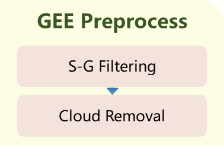

# A daily 30 m NDVI product of cropland in the Shiyang River Basin, Northwestern China of 2022

The code provided in this repository is for implementing or reproducing NDVI data as described in the associated article.

Both input and output remote sensing image files are formatted as TIF.

# Usage

## FORMAT Trans.py

> “To ensure accurate use, NDVI values must be multiplied by a scale factor of 0.0001, converting them from Int16 to Float32.”
> 

This code facilitates the conversion of data formats provided in the article, ensuring compatibility and proper functionality.

## 1_Data Downloding（GEE）

Aligns with the framework.

This script downloads Landsat 8/9 OLI and MOD09GA images, with MOD09GA including S-G filtering. Both are [Google Earth Engine](https://code.earthengine.google.com/) JS codes and can be customized by updating the ROI file in the first line. 

Python download code for Landsat 8/9 OLI is also available upon request via private message.

## 2_Data Preprocessing and Calculation（Python）

### Functions.py

This file includes basic remote sensing image reading, storage, and masking functions. Ensure it is in the same root directory as other **PY** code files when used independently.

### 1.1 Preprocess（Mask_Resample).py

Aligns with the framework.

This script performs farmland masking, image projection, and resampling, with nearest-neighbor resampling set as the default method.

### 1.2 Cropland Integrity.py

To evaluate the farmland integrity rate, the "basic cropland.tif" file must be created following the methodology outlined in the article.

### 2 Cubic.py

Aligns with the framework.

This script aligns the row and column numbers of the input data to meet the input requirements of the **Guided Filter** in the [VSDF model](https://github.com/ChenXuAxel/VSDF).

### 3 NDVI.py、4 Mosaic.py

Aligns with the framework.

This script inverts NDVI values and performs a maximum value mosaic for two images with two channels captured on the same day.
